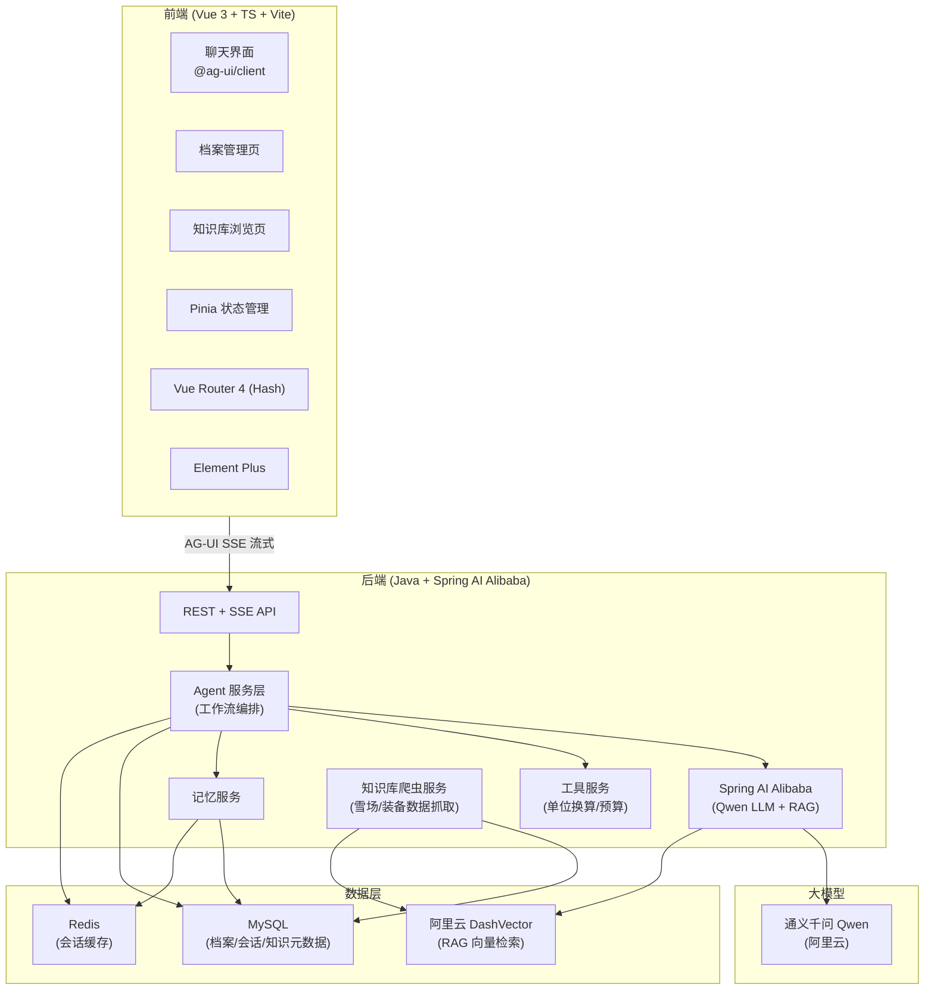
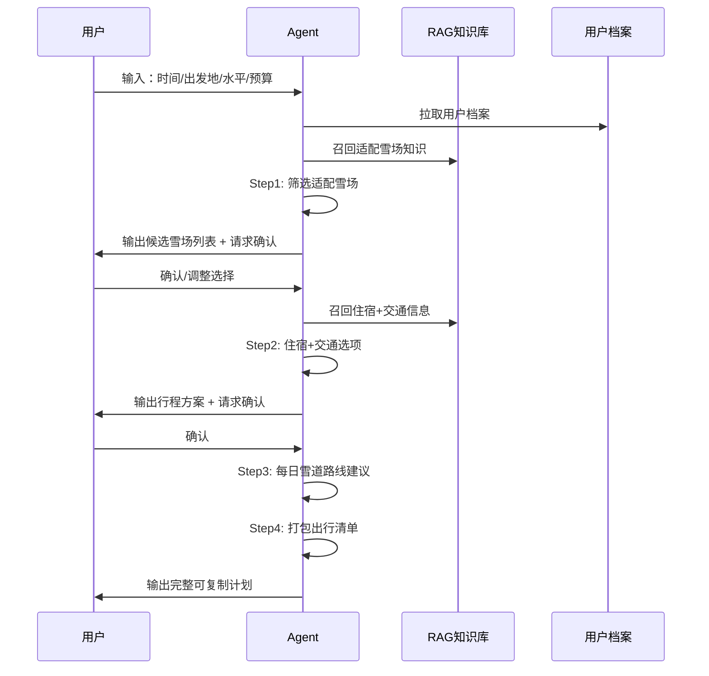
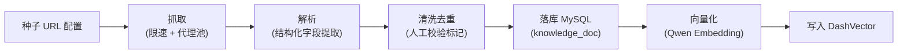
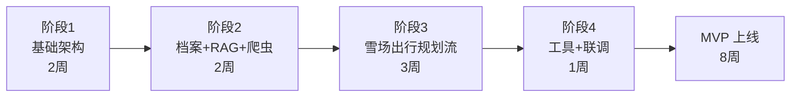

# 🎿 滑雪 Agent MVP 项目进度主文档

> 本文档是滑雪 Agent 项目的**主进度文档 + 阶段索引**，整体产品方案与技术路径在此固化，后续每个阶段的详细需求和技术方案会单独建文档并挂到 [阶段文档索引](#阶段文档索引) 中。

---

## 一、项目概述

### 1.1 产品定位（一句话）

> **"你的滑雪专属助手"** —— 通过「用户档案记忆 + 垂直知识库 + 多步可执行工作流」三件套，做通用大模型做不到的事：**懂你、懂滑雪、能帮你把事办完**。

### 1.2 差异化价值三角

| 维度 | 通用豆包 | 滑雪 Agent |
|---|---|---|
| **记忆** | 无跨会话记忆 | 完整雪季档案 + 会话记忆 |
| **知识** | 通用知识泛而浅 | 垂直雪场/装备/动作知识，可溯源 |
| **能力** | 一问一答 | 多步 Agent 工作流，直接产出可执行计划 |

### 1.3 核心原则

- 砍掉纯聊天问答，优先做通用大模型做不好的事
- MVP 目标：让用户感知到 "这不是普通 AI，是我的滑雪专属助手"
- 所有回答优先带入用户档案（不泛泛推荐）

---

## 二、技术选型（已确认）

### 2.1 前端

| 类别　　　　| 选型　　　　　　　　　　　　　　　　　　　　　　　　　 |
| -------------| --------------------------------------------------------|
| 框架　　　　| Vue 3 + TypeScript　　　　　　　　　　　　　　　　　　 |
| 构建工具　　| Vite 5　　　　　　　　　　　　　　　　　　　　　　　　 |
| 状态管理　　| Pinia　　　　　　　　　　　　　　　　　　　　　　　　　|
| 路由　　　　| Vue Router 4（Hash 模式）　　　　　　　　　　　　　　　|
| UI 组件库 | Element Plus（开源，Vue 3 生态最成熟） |
| 工程化 | pnpm Monorepo + Vite 原生构建 |
| AI 通信协议 | @ag-ui/client + @ag-ui/core（Agent-UI 协议，SSE 流式） |
| Node 版本　 | ≥ 20　　　　　　　　　　　　　　　　　　　　　　　　　 |

> ⚠️ 本项目为**外部独立项目**，不接入 qiankun 微前端，不需要作为子应用挂载。

### 2.2 后端

| 类别 | 选型 |
|---|---|
| 语言/框架 | Java（≥17）+ Spring Boot 3 |
| AI 框架 | Spring AI Alibaba |
| 大模型 | **阿里云通义千问（Qwen）** |
| 向量数据库 | **阿里云 DashVector（向量检索服务）** |
| 关系数据库 | MySQL 8 |
| 缓存 | Redis 7 |
| ORM | MyBatis-Plus |

### 2.3 向量库说明

- **主选**：阿里云 DashVector（达摩院出品的专用向量检索服务）
  - 优势：Serverless 按量付费、与 Spring AI Alibaba 生态契合、原生支持过滤检索
  - 用途：RAG 知识库向量存储 + 召回
- **备选**：阿里云 AnalyticDB for PostgreSQL（带向量检索能力，适合需要复杂 SQL + 向量混合查询的场景）
- **MVP 决策**：先用 DashVector，如后续发现需要结构化 + 向量混合检索再评估切换

---

## 三、MVP 功能清单

### ✅ MUST HAVE（MVP 必做）

#### 1. 用户滑雪档案（Agent 核心，通用豆包没有）

**基础档案**：
- 滑雪水平：初级 / 中级 / 高级 × 刻滑 / 平花 / 公园
- 身体数据：身高、体重、脚长（cm）、鞋码
- 装备参数：雪板长度/类型、雪鞋尺码/硬度、固定器 DIN 值/角度
- 偏好：常用雪场、预算区间、受伤史

**会话记忆**：
- 本雪季去过哪些雪场、踩过的坑、装备清单
- 跨会话复用，不用每次重复输入
- 对话历史提炼为「用户画像片段」，非全量 raw log

**输出**：所有回答优先带入用户档案，例如按脚长 + 水平推荐雪板，而非泛泛推荐。

#### 2. 轻量化 RAG 知识库（垂直数据）

只收高价值子集，不爬全网：

| 知识域 | 关键字段 | MVP 数据量级 | 数据获取方式 |
|---|---|---|---|
| 国内主流雪场 | 开放时间、缆车、雪道难度、食宿、人流、租装备价格、交通 | 30-50 家 | **爬虫抓取 + 人工校验** |
| 装备基础库 | 板/鞋/固定器/护具参数；二手避坑要点 | 100-200 SKU | **爬虫抓取 + 人工校验** |
| 动作库 | 初/中/高常见动作要点 + 受伤风险 | 50-80 个动作 | 人工整理为主 |

**MVP 不接入外网实时搜索**，靠离线知识库保证可控。

#### 3. 三条闭环 Agent 工作流（核心差异化）

| 工作流 | 输入 | 中间步骤 | 输出 | MVP 优先级 |
|---|---|---|---|---|
| **雪场出行规划流** | 时间、出发地、水平、预算 | 筛选雪场→住宿交通→每日路线→打包清单 | 可执行出行计划 | ⭐ **优先做** |
| 装备选购/二手评估流 | 需求、预算、档案 | 筛选适配→参数校验→风险点 | 选购决策清单 | 二期 |
| 雪上问题诊断流 | 症状描述（如"转弯摔、小腿酸"） | 多轮追问场景→排查清单 | 动作诊断报告 | 二期 |

> **MVP 首发聚焦「雪场出行规划流」**，作为 Demo 演示和用户感知差异化的主链路。其余两条工作流在架构上预留扩展点，后续迭代补齐。

#### 4. 基础工具能力

| 工具 | 用途 | 实现方式 |
|---|---|---|
| 单位换算 | 板长 cm↔inch、DIN 值、角度°↔° | 纯算法，本地计算 |
| 预算计算器 | 滑雪出行预算粗算 | 本地公式 + 可配置费率表 |

### ⚠️ SHOULD HAVE（二期迭代，MVP 坚决砍掉）

- 图片识别：上传滑雪视频分析动作
- 实时数据对接：雪场实时人流、雪况 API、票务、电商商品接口
- 社交模块：雪友匹配、约滑、评论社区
- 多模态：生成滑雪路线图、示意图
- 复杂长周期记忆：往年多个雪季完整历史（MVP 只保留当前雪季）
- 多语言、海外雪场知识库

### ❌ MUST NOT HAVE（绝对不做）

- 开放式闲聊："滑雪好玩吗""滑雪起源是什么"这类科普问答
- 通用旅游百科、宽泛的滑雪历史科普
- 完整的长篇教学课文本（只保留针对性诊断）
- 通用生活问答（天气、美食，不做）

---

## 四、系统架构



---

## 五、模块设计

### 5.1 前端模块

**目录结构**：
```
src/
├── main.ts                    # 应用入口 + AG-UI client 初始化
├── App.vue
├── router/                    # Hash 路由
│   └── index.ts
├── stores/                    # Pinia
│   ├── user.ts                # 用户信息
│   ├── profile.ts             # 滑雪档案
│   └── chat.ts                # 会话状态
├── api/                       # 后端接口封装
│   ├── agent.ts               # AG-UI SSE 流式
│   ├── profile.ts
│   └── knowledge.ts
├── views/
│   ├── Chat.vue               # 聊天主界面（核心）
│   ├── Profile.vue            # 档案管理
│   └── Knowledge.vue          # 知识库浏览（只读）
├── components/
│   ├── chat/                  # 消息流、工作流确认卡片
│   ├── profile/               # 档案表单
│   └── common/
└── utils/
    ├── ag-ui.ts               # AG-UI 协议封装
    └── sse.ts                 # SSE 处理
```

**关键实现点**：
1. **AG-UI 协议**：用 `@ag-ui/client` 订阅后端 SSE 流，处理 `text_message` / `tool_call` / `step` 等事件
2. **工作流确认卡片**：Agent 多步执行中需要用户确认时，渲染为交互式卡片组件，而非纯文本
3. **SSE 流式渲染**：消息逐字流式输出，工作流 Step 进度实时更新

### 5.2 后端模块

**模块划分**：
```
ski-agent-backend/
├── ski-agent-api/              # 对外 REST + SSE 接口
├── ski-agent-agent/            # Agent 工作流编排核心
│   ├── workflow/
│   │   ├── TravelPlanWorkflow  # 出行规划流（MVP 优先）
│   │   ├── GearBuyWorkflow     # 装备选购流（二期）
│   │   └── DiagnoseWorkflow    # 问题诊断流（二期）
│   └── core/                   # 通用编排能力（Step/暂停/确认）
├── ski-agent-llm/              # Spring AI Alibaba 封装
│   ├── chat/                   # Qwen 对话
│   ├── rag/                    # RAG 检索（DashVector）
│   └── tool/                   # Function Calling 工具
├── ski-agent-memory/           # 记忆服务（档案 + 会话）
├── ski-agent-knowledge/        # 知识库管理（离线构建 + 在线检索）
├── ski-agent-crawler/          # 知识库爬虫（雪场/装备数据抓取）
├── ski-agent-common/           # 公共工具
└── ski-agent-dao/              # MyBatis 数据访问
```

**Agent 编排核心设计**：
- 用 Spring AI Alibaba 的 `ChatClient` + `Advisor` 机制实现 RAG 注入、记忆注入
- 工作流用「状态机 + Step 列表」模式，每步产出可序列化的中间态，支持暂停/恢复/确认
- 三条工作流抽象出 `AbstractWorkflow` 基类，子类实现 `buildSteps()` 和 `collectInput()`

### 5.3 雪场出行规划流（MVP 优先）Step 拆解



| Step | 动作 | 需要确认 | 依赖 |
|---|---|---|---|
| 0. 收集输入 | 必填字段缺失时多轮追问 | ❌ | 用户输入 |
| 1. 筛选雪场 | 召回雪场知识 + 档案匹配 → Top3 | ✅ | RAG + Profile |
| 2. 住宿交通 | 召回食宿交通 → 生成方案 | ✅ | RAG |
| 3. 每日路线 | 按雪道难度 + 水平生成每日路线 | ❌ | RAG + Profile |
| 4. 打包清单 | 按雪场 + 天气 + 档案生成清单 | ❌ | RAG + Profile |
| 5. 输出计划 | 汇总为可复制 Markdown | ❌ | 全部 |

---

## 六、数据库设计（核心表）

| 表名 | 职责 | 关键字段 |
|---|---|---|
| `user_profile` | 用户滑雪档案 | user_id, level, style, height, weight, foot_length, board_params(json), budget, injured_history |
| `session_memory` | 会话记忆 | user_id, season, visited_resorts(json), pitfalls(json), gear_list(json) |
| `chat_session` | 对话会话 | session_id, user_id, title, created_at |
| `chat_message` | 对话消息 | id, session_id, role, content, tool_calls(json), workflow_state(json) |
| `workflow_run` | 工作流执行实例 | run_id, user_id, workflow_type, status, current_step, context(json) |
| `knowledge_doc` | 知识库文档元数据 | doc_id, category(resort/gear/action), source, content, vector_id, metadata(json) |
| `knowledge_chunk` | 知识库切片 | chunk_id, doc_id, content, vector_id, position |

> DashVector 中只存向量 + 业务主键，元数据回查 MySQL。

---

## 七、知识库爬虫方案（数据获取）

MVP 知识库数据通过爬虫抓取 + 人工校验的方式构建，独立为 `ski-agent-crawler` 模块。

### 7.1 抓取范围

| 数据域　　　 | 抓取来源　　　　　　　　　　　 | 字段　　　　　　　　　　　　　　　　　　　　　　　　　 | 量级　　　　|
| --------------| --------------------------------| --------------------------------------------------------| -------------|
| 国内主流雪场 | 雪场官网、滑雪资讯站、地图服务 | 开放时间、缆车、雪道难度、食宿、人流、租装备价格、交通 | 30-50 家　　|
| 装备基础库　 | 电商商品页、装备评测站　　　　 | 板/鞋/固定器/护具参数；二手避坑要点　　　　　　　　　　| 100-200 SKU |

### 7.2 抓取流程



### 7.3 实现要点

- **合规性**：遵守目标站点 `robots.txt`，限速抓取，不抓取需要登录/付费的内容
- **增量更新**：按 URL 哈希去重，支持重跑增量
- **人工校验**：抓取后标记 `review_status`，人工确认后才进入向量化流程
- **调度**：MVP 用定时任务（Spring Scheduled）即可，二期可换分布式调度

---

## 八、MVP 开发阶段规划



| 阶段　　　　　　　　　　 | 周期 | 交付物　　　　　　　　　　　　　　　　　　　　　　　　　　　　　　　　　　　　　　　　　　　　　　　　　　　　　　　　　　　　　 | 状态　　 |
| --------------------------| ------| ----------------------------------------------------------------------------------------------------------------------------------| ----------|
| **阶段1 基础架构**　　　 | 2 周 | 前端脚手架（Vite+Pinia+Router+kui）、后端脚手架（Spring Boot+MyBatis+AG-UI SSE 跑通 hello world）、MySQL 表结构、DashVector 开通 | ⬜ 待启动 |
| **阶段2 档案+RAG+爬虫**　| 2 周 | 用户档案 CRUD、会话记忆、RAG 知识库离线构建 + 在线检索接口、爬虫模块跑通雪场抓取、前端档案页 + 聊天页骨架　　　　　　　　　　　　| ⬜ 待启动 |
| **阶段3 雪场出行规划流** | 3 周 | 通用 Workflow 编排框架、雪场出行规划流端到端跑通、工作流确认卡片组件　　　　　　　　　　　　　　　　　　　　　　　　　　　　　　 | ⬜ 待启动 |
| **阶段4 工具+联调**　　　| 1 周 | 单位换算/预算计算工具、端到端联调、压测 + Bug 修复　　　　　　　　　　　　　　　　　　　　　　　　　　　　　　　　　　　　　　　 | ⬜ 待启动 |

> 状态图例：⬜ 待启动 / 🟡 进行中 / ✅ 已完成

---

## 九、风险点 & 应对

| 风险 | 应对 |
|---|---|
| **知识库数据量小导致 RAG 效果差** | MVP 只收 30-50 雪场 + 100-200 装备，保证质量优先；切片保留结构化字段而非纯长文本 |
| **工作流多轮确认体验卡顿** | 用 AG-UI SSE 实时推送 Step 进度，前端用卡片组件而非阻塞式弹窗 |
| **大模型成本** | 通义千问性价比高；档案/记忆用小模型摘要，RAG 检索后只传 Top-K |
| **爬虫合规性** | 遵守 robots.txt，限速抓取，人工校验后才入库，不抓付费内容 |
| **DashVector 冷启动** | 阶段1 先开通实例 + 跑通最小向量化 demo，避免阶段2 才发现问题 |
| **⚠️ 别手痒做实时数据** | 严守 MVP 边界，实时人流/票务/电商 API 全部二期 |

---

## 十、阶段文档索引

> 后续每个阶段的详细需求和技术方案会单独建文档，在此索引更新。

| 阶段 | 文档路径 | 状态 |
|---|---|---|
| 阶段1 基础架构 | _待补充_ | ⬜ |
| 阶段2 档案+RAG+爬虫 | _待补充_ | ⬜ |
| 阶段3 雪场出行规划流 | _待补充_ | ⬜ |
| 阶段4 工具+联调 | _待补充_ | ⬜ |

---

## 十一、进度跟踪

| 日期 | 进度 | 备注 |
|---|---|---|
| 2026-08-20 | 项目方案确认完成，主文档创建 | 已确认：通义千问 + DashVector + 不接 qianyun + 爬虫抓数据 + 雪场出行规划流优先 |

---

## 十二、下一步

- [ ] 等待宝贝提供**阶段1 基础架构**的详细需求和技术方案描述
- [ ] 阶段1 文档创建并挂入索引
- [ ] 启动阶段1 开发
