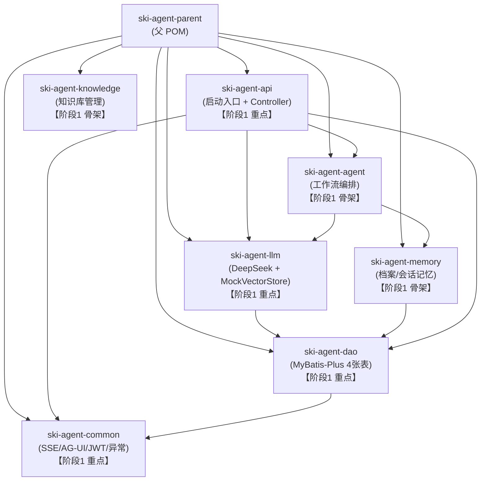
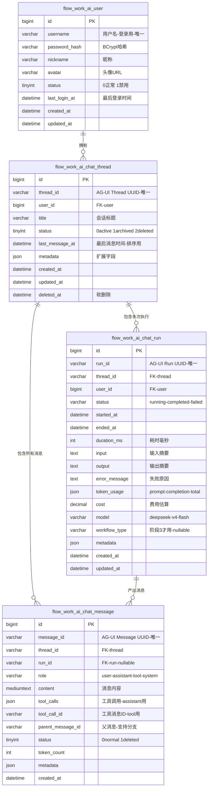
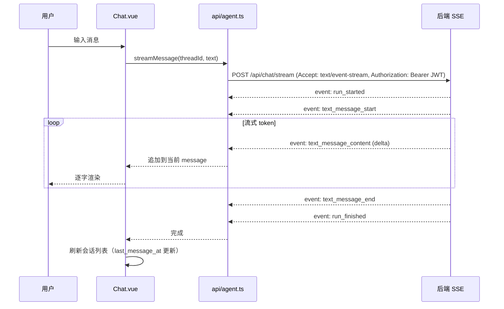
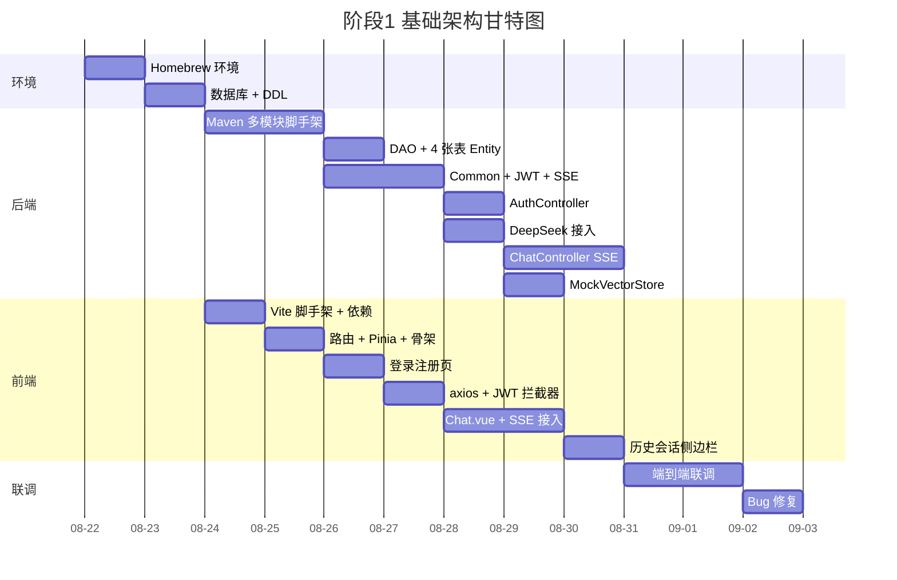

# 阶段1：基础架构详细需求 & 技术方案

> 本文档是滑雪 Agent 项目阶段1（基础架构）的详细需求和技术方案，经宝贝确认后作为开发依据。
> 创建时间：2026-08-22
> 周期：2 周

---

## 一、阶段目标

**2 周内交付**：前后端脚手架跑通最小闭环，为阶段2（档案 + RAG + 爬虫）打好底座。

### 验收标准（Hello World 链路）

前端发一条消息 → 后端通过 AG-UI SSE 流式返回 → 中间走一次 DeepSeek V4 Flash 请求 → 前端流式显示回复。同时 MySQL/Redis 全部连通，历史会话持久化到 MySQL。

```mermaid
flowchart LR
    subgraph 验收链路["阶段1 验收链路"]
        FE["前端 Chat.vue<br/>登录后输入消息<br/>流式显示 + 历史会话侧边栏"] -->|POST /api/chat SSE<br/>Authorization: Bearer JWT| BE
        BE["后端 ski-agent-api<br/>JWT 校验 + AG-UI 事件流封装"] --> DeepSeek["Spring AI<br/>OpenAI 兼容协议<br/>调用 DeepSeek V4 Flash"]
        DeepSeek -->|流式 token| BE
        BE -->|SSE event| FE
        BE --> MySQL[(MySQL<br/>4 张表")]
        BE --> Redis[(Redis<br/>JWT 黑名单 + 会话缓存)]
    end
```

---

## 二、关键决策（已确认）

| 决策点 | 选择 | 说明 |
|---|---|---|
| 代码仓库结构 | **单仓库双目录**（`frontend/` + `backend/`） | 方便版本同步、issue 统一管理 |
| 本地 MySQL/Redis | **Homebrew 本地安装** | `brew install mysql@8.4 redis` |
| 大模型 | **DeepSeek V4 Flash** | OpenAI 兼容协议，Spring AI 对接 |
| 向量库 | **阶段1 用本地 Mock**，阶段2 再接 DashVector | `MockVectorStore` 实现 `VectorStore` 接口 |
| 用户体系 | **简单登录 + 注册**（JWT Token） | 后续接微信小程序 / 手机登录 |
| Hello World 范围 | **历史会话持久化到 MySQL**，3 张 chat 表 + 1 张 user 表 | 符合 AG-UI Thread/Run/Message 模型 |
| 用户表名 | `flow_work_ai_user` | 与其他三张 chat 表保持 `flow_work_ai_` 前缀一致 |

---

## 三、交付物清单

| # | 交付物 | 说明 |
|---|---|---|
| 1 | 前端脚手架 | Vite 5 + Vue 3 + TS + Pinia + Router(Hash) + Element Plus + AG-UI client |
| 2 | 后端脚手架 | Spring Boot 3 + Java 17 + Maven 多模块 + MyBatis-Plus + Redis + Spring AI |
| 3 | 数据库初始化 | 4 张表 DDL + 初始化脚本（`flow_work_ai_user` + 3 张 chat 表） |
| 4 | Homebrew 环境 | MySQL 8.4 + Redis 7 安装 + 数据库初始化 |
| 5 | 登录注册 | 注册 + 登录 + JWT 鉴权 + 路由守卫 |
| 6 | Hello World 链路 | 前端聊天页发消息 → 后端 SSE 流式回 → DeepSeek 真实调用 + 历史会话持久化 |
| 7 | Mock 向量库 | `MockVectorStore` 实现 `VectorStore` 接口，阶段2 零改动切换 DashVector |
| 8 | 阶段1 文档 | 本文档 `docs/phases/phase-1-architecture.md` |

---

## 四、代码仓库结构

```
Ski-Agent/                         # 仓库根目录
├── AGENTS.md                      # ✅ AI 协作规则
├── README.md                      # ✅ 项目说明
├── .gitignore                     # ✅ 忽略规则
├── .env.example                   # ⏳ 环境变量模板（进 git）
├── .env                           # ⏳ 实际环境变量（不进 git，含 API Key）
├── docs/                          # ✅ 文档目录
│   ├── PROJECT_PLAN.md            # ✅ 主进度文档
│   └── phases/
│       └── phase-1-architecture.md  # ⏳ 本文档
├── frontend/                      # ⏳ 前端项目
│   ├── package.json
│   ├── pnpm-lock.yaml
│   ├── vite.config.ts
│   ├── tsconfig.json
│   ├── index.html
│   ├── .env                       # 前端环境变量（VITE_API_BASE 等，不进 git）
│   ├── .env.example               # 前端环境变量模板（进 git）
│   └── src/
│       ├── main.ts                # 入口：初始化 Pinia/Router/ElementPlus/AG-UI
│       ├── App.vue
│       ├── router/                # Hash 路由 + 路由守卫
│       │   └── index.ts
│       ├── stores/                # Pinia
│       │   ├── user.ts            # 用户 + JWT token
│       │   └── chat.ts            # 会话列表 + 当前会话消息流
│       ├── api/
│       │   ├── auth.ts            # 注册/登录接口
│       │   ├── agent.ts           # AG-UI SSE 流式接口
│       │   └── request.ts         # axios 封装 + JWT 拦截器
│       ├── views/
│       │   ├── Login.vue          # 登录注册页（阶段1 实现）
│       │   ├── Chat.vue           # 聊天主界面（阶段1 实现）
│       │   ├── Profile.vue        # 档案骨架（阶段2 填充）
│       │   └── Knowledge.vue      # 知识库骨架（阶段2 填充）
│       ├── components/
│       │   ├── chat/
│       │   │   ├── MessageList.vue    # 消息列表（流式渲染）
│       │   │   ├── MessageInput.vue    # 输入框
│       │   │   └── SessionSidebar.vue  # 历史会话侧边栏
│       │   └── common/
│       └── utils/
│           ├── ag-ui.ts           # AG-UI 协议封装
│           └── sse.ts             # SSE 处理
└── backend/                       # ⏳ 后端项目
    ├── pom.xml                    # 父 POM
    ├── ski-agent-api/             # Controller + SSE + 启动类【重点】
    ├── ski-agent-agent/           # Agent 工作流编排【阶段1 留骨架】
    ├── ski-agent-llm/             # Spring AI + DeepSeek + MockVectorStore【重点】
    ├── ski-agent-memory/          # 记忆服务【阶段1 留骨架】
    ├── ski-agent-knowledge/       # 知识库管理【阶段1 留骨架】
    ├── ski-agent-common/          # 公共工具：SSE/AG-UI 事件/异常/JWT【重点】
    └── ski-agent-dao/             # MyBatis-Plus Entity/Mapper【重点】
```

> 注：`ski-agent-crawler` 阶段1 不建，阶段2 再建。

---

## 五、后端 Maven 多模块设计



### 5.1 各模块阶段1 进度

| 模块 | 阶段1 状态 | 关键类 |
|---|---|---|
| `ski-agent-api` | ✅ 重点实现 | `SkiAgentApplication`、`AuthController`、`ChatController`、`SseChatService` |
| `ski-agent-llm` | ✅ 重点实现 | `DeepSeekChatService`（Spring AI `OpenAiChatModel`）、`MockVectorStore`、`VectorStore` 接口 |
| `ski-agent-dao` | ✅ 重点实现 | 4 张表 Entity + Mapper + MyBatis-Plus 配置 |
| `ski-agent-common` | ✅ 重点实现 | `JwtUtil`、`AgUiEvent`、`SseEmitterUtil`、`BusinessException`、`GlobalExceptionHandler` |
| `ski-agent-agent` | 🟡 骨架 | `AbstractWorkflow` 抽象类 + `WorkflowContext`（不实现具体工作流） |
| `ski-agent-memory` | 🟡 骨架 | `MemoryService` 接口（不实现） |
| `ski-agent-knowledge` | 🟡 骨架 | `KnowledgeService` 接口（不实现） |

---

## 六、数据库设计

### 6.1 表清单

| 表名 | 职责 | 阶段1 用途 |
|---|---|---|
| `flow_work_ai_user` | 用户表 | **登录注册** |
| `flow_work_ai_chat_thread` | 会话线程表 | **Hello World 会话记录** |
| `flow_work_ai_chat_run` | Agent 执行记录表 | **Hello World 每次执行** |
| `flow_work_ai_chat_message` | 消息表 | **Hello World 消息持久化** |

### 6.2 ER 关系图



### 6.3 索引设计

| 表 | 索引 | 说明 |
|---|---|---|
| `flow_work_ai_user` | `uk_username` (username) | 登录查询 |
| `flow_work_ai_chat_thread` | `uk_thread_id` (thread_id) | AG-UI Thread ID 查询 |
| `flow_work_ai_chat_thread` | `idx_user_lastmsg` (user_id, last_message_at DESC) | 用户会话列表排序 |
| `flow_work_ai_chat_run` | `uk_run_id` (run_id) | AG-UI Run ID 查询 |
| `flow_work_ai_chat_run` | `idx_thread_started` (thread_id, started_at DESC) | 会话内执行历史 |
| `flow_work_ai_chat_message` | `idx_thread_created` (thread_id, created_at) | 会话内消息时间序 |
| `flow_work_ai_chat_message` | `idx_parent` (parent_message_id) | 消息分支查询 |

---

## 七、接口设计

### 7.1 认证接口

| 接口 | 方法 | 路径 | 入参 | 出参 |
|---|---|---|---|---|
| 注册 | POST | `/api/auth/register` | `{username, password, nickname?}` | `{token, userInfo}` |
| 登录 | POST | `/api/auth/login` | `{username, password}` | `{token, userInfo}` |
| 获取当前用户 | GET | `/api/auth/me` | (Header: Authorization) | `{userInfo}` |

### 7.2 聊天接口（AG-UI SSE 流式）

| 接口 | 方法 | 路径 | 说明 |
|---|---|---|---|
| 发送消息（流式） | POST | `/api/chat/stream` | SSE 流式返回 AG-UI 事件 |
| 创建会话 | POST | `/api/chat/threads` | `{title?}` → `{threadId}` |
| 会话列表 | GET | `/api/chat/threads` | 返回当前用户会话列表 |
| 会话消息历史 | GET | `/api/chat/threads/{threadId}/messages` | 返回该会话所有消息 |
| 删除会话 | DELETE | `/api/chat/threads/{threadId}` | 软删除 |

### 7.3 AG-UI SSE 事件流（阶段1 最小集）

后端按 AG-UI 协议推送以下事件（阶段1 只用 text_message 系列）：

| 事件 | 时机 | 阶段1 用 |
|---|---|---|
| `run_started` | Run 开始 | ✅ |
| `text_message_start` | assistant 消息开始 | ✅ |
| `text_message_content` | 流式 token | ✅ |
| `text_message_end` | assistant 消息结束 | ✅ |
| `run_finished` | Run 完成 | ✅ |
| `run_error` | Run 失败 | ✅ |
| `tool_call_start` / `tool_call_end` | 工具调用 | ⏳ 阶段3 |

---

## 八、前端关键实现点

### 8.1 AG-UI SSE 流式接入



### 8.2 路由设计（Hash 模式）

| 路径 | 页面 | 阶段1 状态 | 是否需要登录 |
|---|---|---|---|
| `/login` | 登录注册页 | ✅ 实现 | 否 |
| `/` → 重定向 `/chat` | - | ✅ | 是 |
| `/chat` | 聊天主界面 | ✅ 实现 | 是 |
| `/chat/:threadId` | 指定会话聊天 | ✅ 实现 | 是 |
| `/profile` | 档案管理 | 🟡 骨架 | 是 |
| `/knowledge` | 知识库浏览 | 🟡 骨架 | 是 |

**路由守卫**：未登录访问需登录页 → 重定向 `/login` 并携带 `redirect` 参数。

### 8.3 Pinia Store 设计

| Store | 职责 | 阶段1 状态 |
|---|---|---|
| `useUserStore` | 用户信息 + JWT token + 登录/注册/登出 | ✅ 实现 |
| `useChatStore` | 会话列表 + 当前会话 + 消息流 + 流式状态 | ✅ 实现 |

---

## 九、本地环境方案（Homebrew）

### 9.1 需要安装的软件

| 软件 | 版本 | 用途 |
|---|---|---|
| MySQL | 8.4 | 主数据库 |
| Redis | 7.x | JWT 黑名单 + 会话缓存 |
| Java | 17 | 后端运行时 |
| Maven | 3.9+ | 后端构建 |
| Node.js | ≥ 20 | 前端运行时 |
| pnpm | 9.x | 前端包管理 |

### 9.2 数据库初始化

```sql
-- 建库
CREATE DATABASE ski_agent DEFAULT CHARACTER SET utf8mb4 COLLATE utf8mb4_unicode_ci;

-- 建用户（仅本机开发用，密码随机生成写入 .env）
CREATE USER 'ski_agent'@'localhost' IDENTIFIED BY '<random-password>';
GRANT ALL PRIVILEGES ON ski_agent.* TO 'ski_agent'@'localhost';
FLUSH PRIVILEGES;
```

### 9.3 娇姐的执行计划

1. 先探测本机已安装的软件版本（只读，不改环境）
2. 列出需要安装的清单，宝贝批准后娇姐执行 `brew install`
3. 启动服务 `brew services start mysql@8.4 redis`
4. 初始化数据库 + 用户
5. 跑 DDL 建表脚本

---

## 十、Mock 向量库方案（阶段1）

### 10.1 接口设计

```java
public interface VectorStore {
    String insert(VectorDocument doc);          // 插入，返回 vectorId
    List<VectorDocument> search(float[] queryVector, int topK, String category);  // 检索
    boolean delete(String vectorId);            // 删除
}

public class VectorDocument {
    private String id;
    private String content;
    private String category;      // resort / gear / action
    private float[] vector;
    private Map<String, Object> metadata;
}
```

### 10.2 Mock 实现

```java
@Component
@ConditionalOnProperty(name = "ski.vectorstore.type", havingValue = "mock", matchIfMissing = true)
public class MockVectorStore implements VectorStore {
    // 阶段1：用 ConcurrentHashMap 存向量
    // 检索：用余弦相似度计算 Top-K（MVP 数据量小，够用）
    // 阶段2 换成 DashVectorVectorStore，业务代码零改动
}
```

### 10.3 阶段2 切换方式

```yaml
# application.yml
ski:
  vectorstore:
    type: mock          # 阶段1：mock / 阶段2：dashvector
```

---

## 十一、环境变量方案（.env）

### 11.1 后端 `.env`（不进 git）

```bash
# 数据库
DB_HOST=localhost
DB_PORT=3306
DB_NAME=ski_agent
DB_USERNAME=ski_agent
DB_PASSWORD=<随机生成>

# Redis
REDIS_HOST=localhost
REDIS_PORT=6379

# DeepSeek
DEEPSEEK_API_KEY=sk-xxx
DEEPSEEK_BASE_URL=https://api.deepseek.com
DEEPSEEK_MODEL=deepseek-v4-flash

# JWT
JWT_SECRET=<随机生成 64 字符>
JWT_EXPIRE_HOURS=72

# 向量库
SKI_VECTORSTORE_TYPE=mock
```

### 11.2 前端 `.env`（不进 git）

```bash
VITE_API_BASE=http://localhost:8080/api
```

### 11.3 `.env.example`（进 git，作为模板）

上述两个 `.env` 的模板，所有敏感值用 `<placeholder>` 占位，进 git 作为开发者参考。

---

## 十二、阶段1 任务拆解（2 周）



| 周 | 任务 |
|---|---|
| **第1周** | 环境搭建 + 后端 DAO/Common/Auth + 前端脚手架/登录 |
| **第2周** | 后端 ChatController + DeepSeek + 前端 Chat.vue + 联调 |

---

## 十三、风险点 & 应对

| 风险 | 应对 |
|---|---|
| DeepSeek API Key 模型 ID 不确定 | 娇姐先用 `deepseek-v4-flash` 占位，等真接入时根据 DeepSeek 官方文档确认确切 model ID |
| AG-UI 协议细节 | 阶段1 先实现最小事件集（run/text_message），阶段3 再扩展 tool_call |
| Homebrew 安装失败 | 娇姐先探测环境，列出依赖，宝贝批准后再装；遇到权限问题用 `sudo chown` 处理 |
| DeepSeek 限流 | MVP 单用户开发测试，不会触限；保留 Mock LLM 模式做离线开发兜底 |
| API Key 泄露 | 已写入 `.gitignore` 忽略 `.env`；建议宝贝用完到 DeepSeek 后台轮换 Key |

---

## 十四、验收清单

阶段1 完成时，以下全部要 ✅：

- [ ] Homebrew 安装 MySQL 8.4 + Redis 7 成功，服务启动
- [ ] 数据库 `ski_agent` 建好，4 张表 DDL 跑通
- [ ] 后端 8 个 Maven 模块建好，能 `mvn clean install` 通过
- [ ] 后端启动成功，连上 MySQL + Redis
- [ ] 注册接口 `POST /api/auth/register` 跑通
- [ ] 登录接口 `POST /api/auth/login` 跑通，返回 JWT
- [ ] `GET /api/auth/me` 带 JWT 能拿到用户信息
- [ ] 创建会话 `POST /api/chat/threads` 跑通
- [ ] 流式聊天 `POST /api/chat/stream` 跑通，DeepSeek 真实调用
- [ ] 历史会话 `GET /api/chat/threads` + `GET /api/chat/threads/{id}/messages` 跑通
- [ ] 前端登录注册页跑通
- [ ] 前端聊天页流式显示跑通
- [ ] 前端历史会话侧边栏跑通，可切换会话
- [ ] `MockVectorStore` 实现完整，单元测试通过
- [ ] `.env` 配置完整，`.env.example` 进 git，`.env` 不进 git
- [ ] 阶段1 文档（本文档）完成并挂入主文档索引

---

## 十五、下一步

1. 宝贝确认本文档 → 娇姐调整后定稿
2. 娇姐开始执行：
   - 探测本地环境 → 安装 Homebrew 依赖 → 初始化数据库
   - 创建后端 Maven 多模块脚手架
   - 创建前端 Vite 脚手架
   - 按甘特图依次实现
3. 阶段1 完成后，进入阶段2（档案 + RAG + 爬虫）
